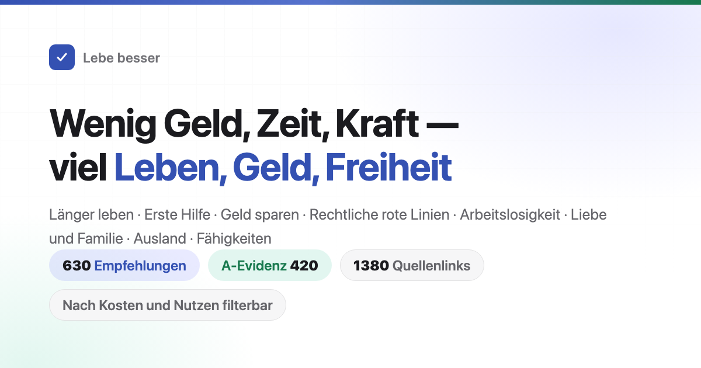

<div align="center">



# Lebe besser: 630 Empfehlungen nach Kosten und Nutzen

Wie du länger lebst und seltener krank wirst, und was bei einem Notfall zuerst zu tun ist. Wie du kein Geld unnötig ausgibst, und welche Dinge dich in einen Betrug oder einen Rechtsstreit bringen. Was du beantragen kannst, wenn du keine Arbeit und kein Geld hast, und welche Formalitäten ein Laden, eine Firma oder eine Website braucht. Auch um Liebe, Heirat, Kinder, Auslandsaufenthalte und Handwerk geht es.<br>
630 Empfehlungen. Bei jeder steht, was sie kostet, was sie bringt und wie belastbar die Belege sind. Als Quellen sind nur Fachaufsätze und amtliche Dokumente angegeben.

Du musst nicht alles umsetzen: Das hier ist eine nach Kosten und Nutzen sortierte Vorschlagsliste, keine Aufgabenliste. Ein oder zwei Punkte herauszunehmen zählt schon. Der Autor selbst befolgt die meisten davon nicht.

[](https://cagliostro.github.io/HowToLiveBetterInGermany/)
[](#inhalt)
[](#evidenzstufen)
[](docs/pruefprotokolle/)
[](#lizenz)

### [Zur Online-Suche](https://cagliostro.github.io/HowToLiveBetterInGermany/) · [Die KI antwortet nach dem Buch (Skill)](skills/lebensentscheidungen/README.md)

Der Skill für KI-Assistenten läuft in Claude Code und Codex. Nach der Installation fragst du direkt: „Soll ich für einen Freund bürgen?" Er sucht zuerst die passenden Einträge im Buch und antwortet dann, mit der Angabe, aus welchem Abschnitt und welcher Nummer er sie hat.

<table>
<tr><td align="right"><b>Download</b></td><td align="left">

[PDF](https://github.com/Cagliostro/HowToLiveBetterInGermany/releases/download/epub-latest/LebeBesser.pdf) · [EPUB](https://github.com/Cagliostro/HowToLiveBetterInGermany/releases/download/epub-latest/LebeBesser.epub) · [Einzeldatei für offline (HTML)](https://github.com/Cagliostro/HowToLiveBetterInGermany/releases/download/epub-latest/LebeBesser.html)

</td></tr>
<tr><td align="right"><b>Nachschlagen</b></td><td align="left">

[Inhalt](#inhalt) · [Glossar](#die-zahlen-verstehen-glossar) · [Prüfprotokolle](docs/pruefprotokolle/)

</td></tr>
<tr><td align="right"><b>Langtexte</b></td><td align="left">

[Lohnt sich heiraten](docs/lohnt-sich-heiraten.md) · [Notfallausrüstung für die Familie](docs/notfallausruestung.md) · [Bei einem Notfall mit Fremden anhalten?](docs/anhalten-bei-fremdem-notfall.md) · [Welche Genehmigungen braucht eine Plattform](docs/welche-lizenzen-fuer-eine-plattform.md) · [Innere Uhr und Nachtschicht](docs/innere-uhr-und-nachtschicht.md)

</td></tr>
<tr><td align="right"><b>Andere Sprachen</b></td><td align="left">

[中文 (Original)](https://github.com/eternity4719/HowToLiveBetter) · [English](https://dlgrv.github.io/HowToLiveBetter/en/) · [Русский](https://dlgrv.github.io/HowToLiveBetter/ru/) · [Español](https://dlgrv.github.io/HowToLiveBetter/es/) — die Übersetzungen stammen von [dlgrv](https://github.com/dlgrv) ([Repository](https://github.com/dlgrv/HowToLiveBetter))

</td></tr>
<tr><td align="right"><b>Zusatzwerkzeuge</b></td><td align="left">

[howtolivebetter.net](https://howtolivebetter.net/) — eine Abhakliste von [littleben](https://github.com/littleben): Aufgaben hinzufügen, als erledigt markieren, merken

</td></tr>
</table>

<sub>Andere Sprachen und Zusatzwerkzeuge werden von anderen gepflegt und können hinterherhinken. Maßgeblich ist der chinesische Originaltext in seinem Repository.</sub>

</div>

---

## Fragen, die dieses Buch beantwortet

| Frage | Wo du nachschaust |
| --- | --- |
| Welche Dinge senken die Wahrscheinlichkeit eines frühen Todes deutlich und kosten fast nichts? | [1. Nicht früh sterben](book/01-nicht-frueh-sterben.md) |
| Wie viel Lebenszeit kosten Rauchen, Alkohol, langes Sitzen und späte Nächte wirklich, wie entwöhnst du dich konkret vom Rauchen und vom Alkohol, und welches Speiseöl nimmst du zu Hause und wie verwendest du es? | [2. Nicht langsam sterben](book/02-nicht-langsam-sterben.md) |
| Dir geht jeden Tag die Kraft aus und du wirst ständig unterbrochen — was hilft? | [3. Keine Energie verschwenden](book/03-keine-energie-verschwenden.md) |
| Wohin geht deine Zeit, wie machst du weniger Dinge ohne Ertrag, und was hilft gegen Aufschieben? | [4. Keine Zeit verschwenden](book/04-keine-zeit-verschwenden.md) |
| Wie legst du dein Erspartes an, ohne dass Zinsen, Gebühren und Betrug es auffressen? | [5. Kein Geld verschwenden](book/05-kein-geld-verschwenden.md) |
| Welche Nahrungsergänzungsmittel, Gesundheits-Checks und Abzockereien kannst du dir direkt sparen? | [6. Die Negativliste](book/06-die-negativliste.md) |
| Arbeitslos, Lohn nicht gezahlt, kein Geld mehr — was steht dir zu, und wo bekommst du Hilfe? | [7. Leben ohne Geld](book/07-leben-ohne-geld.md) |
| Wem gehört der Brautpreis, wem das vor der Ehe gekaufte Haus, wem eine große Überweisung während der Beziehung? Was tust du als Erstes, wenn jemand dich anzeigt oder dich mit erfundenen Tatsachen denunziert? Wie viel Strafminderung bringt es, wenn du nach einer eigenen Tat von selbst zur Polizei gehst? Und kannst du danach noch vorgehen und Schadenersatz verlangen? | [8. Lass dich nicht hereinziehen](book/08-lass-dich-nicht-hereinziehen.md) |
| Welche „Nebenjobs" und beiläufigen Gefälligkeiten machen aus einem normalen Menschen einen Strafangeklagten? | [9. Rechtliche rote Linien](book/09-rechtliche-rote-linien.md) |
| Beim Werben lieber breit streuen oder auf einen einzigen setzen? Kann eine Fernbeziehung halten? Und was bringst du zur Anmeldung der Ehe mit? | [10. Liebe und Heirat](book/10-liebe-und-ehe.md) |
| Welcher Code und welche Aufträge bringen dich ins Gefängnis? | [11. Rote Linien für Techniker](book/11-rote-linien-fuer-techniker.md) |
| Was musst du vor einem Kredit für einen Laden oder eine Firma zuerst klären? | [12. Gründen und Geschäft](book/12-gruenden-und-geschaeft.md) |
| Jemand liegt ohne Atmung am Boden, starke Blutung, Feuer, verlaufen — was machst du zuerst? | [13. Notfälle](book/13-notfaelle.md) |
| Konto gehackt, Handy verloren — was ist der erste Schritt? | [14. Konten und Informationssicherheit](book/14-konten-und-informationssicherheit.md) |
| Kaution einbehalten, Vermieter wirft dich hinaus, der Anbieter von Langzeitmietwohnungen ist pleite — was nun? | [15. Mieten und Kaufen](book/15-mieten-und-kaufen.md) |
| Nach der Diagnose einer chronischen Krankheit: Wie führst du sie langfristig, und wie gibst du weniger Geld aus? | [16. Leben mit chronischer Krankheit](book/16-leben-mit-chronischer-krankheit.md) |
| Wie regelst du Vorsorgevollmacht, Testament und Geld für alte Menschen rechtzeitig? | [17. Alte Menschen in der Familie](book/17-alte-menschen-in-der-familie.md) |
| Was steht dir bei einem Kind zu, und wie viel Zeit und Geld kostet es? | [18. Kinder großziehen](book/18-kinder-grossziehen.md) |
| Wie werden Überstundenvergütung und Jahresurlaub berechnet, wie viel Abfindung bekommst du bei einer Kündigung, und wie wird ein Arbeitsunfall anerkannt und bezahlt? | [19. Arbeitsverhältnis und Arbeitsunfall](book/19-arbeitsverhaeltnis-und-arbeitsunfall.md) |
| Ein Kind ist gerade geboren — was sind die wichtigsten Dinge? | [20. Neugeborene](book/20-neugeborene.md) |
| Welche Länder solltest du derzeit meiden, und wie weit hilft dir die Botschaft, wenn etwas passiert? | [21. Ausland und Reisen](book/21-ausland-und-reisen.md) |
| Wie gehst du in Karaoke-Bar, Internetcafé und Escape-Room nicht in die Falle, und was hilft am besten gegen Stress? | [22. Entspannen](book/22-entspannen.md) |
| Schweißen lernen, Englisch lernen, Zertifikate machen — was bringt das Geld wirklich zurück, wie lernst du zeitsparend, und wo beantragst du einen Berufstitel und lohnt er sich? | [23. Welche Fähigkeiten sich lohnen](book/23-welche-faehigkeiten-sich-lohnen.md) |
| Wie viel kostet dieselbe Krankheit in der Gemeindepraxis und im Klinikum der dritten Stufe? Bei einer schweren Verletzung: anstellen und Termin holen oder direkt zur Notaufnahme? Und brauchst du danach ein Behinderungsgutachten und einen Schwerbehindertenausweis? | [24. Arztbesuche](book/24-arztbesuche.md) |
| Ein Angehöriger ist gestorben — was machst du zuerst, welches Geld kannst du abrufen, und welche Kosten musst du nicht zahlen? | [25. Nach dem Tod](book/25-nach-dem-tod.md) |
| Eine Website oder Plattform, die Geld einnimmt: Welche Genehmigungen brauchst du, und wo steht der Server? | [26. Website oder Plattform](book/26-website-oder-plattform.md) |
| Schwanger, kurz vor der Geburt — was ist wann zu tun, und welche Papiere brauchst du vor der Entlassung? | [27. Schwangerschaft und Geburt](book/27-schwangerschaft-und-geburt.md) |
| Abnehmen oder besser aussehen — welche Methoden richten deinen Körper zugrunde? | [28. Nicht fürs Aussehen ruinieren](book/28-nicht-fuers-aussehen-ruinieren.md) |
| Ein Angehöriger gestorben, entlassen worden, eine schwere Diagnose bekommen — was zählt in den ersten Monaten? | [29. Nach einem schweren Schlag](book/29-nach-einem-schweren-schlag.md) |
| Was am Körper und an der Psyche eines Schulkindes darf nicht bis nach den Prüfungen warten? | [30. Schulkinder](book/30-schulkinder.md) |
| Welche Wege gibt es nach achtzehn außer Studium und Arbeit, und welche Hürde hat jeder? | [31. Wege nach achtzehn](book/31-wege-nach-achtzehn.md) |
| Auslandsstudium: Wann gilt dein Aufenthaltsstatus als unterbrochen, und wird der Abschluss zu Hause anerkannt? | [32. Studium im Ausland](book/32-studium-im-ausland.md) |
| Du oder ein Angehöriger ist behindert — welche Folgeerkrankungen gilt es zuerst zu verhindern, welche Leistungen kannst du beantragen, und wie steht es mit Schule, Arbeit und Betreuung? | [33. Leben mit Behinderung](book/33-leben-mit-behinderung.md) |
| Erkältungs-, Fieber- und Magenmittel selbst gekauft: Was darf nicht zusammen eingenommen werden, und was müssen Kinder, Schwangere und alte Menschen meiden? | [34. Hausapotheke](book/34-hausapotheke.md) |

## Wie du dieses Buch liest

- **Du musst nicht alles umsetzen**: Das hier ist eine nach Kosten und Nutzen sortierte Vorschlagsliste, keine Aufgabenliste. Ein oder zwei Punkte herauszunehmen zählt schon, den Rest lässt du liegen und kommst zurück, wenn du ihn brauchst. Der Satz „leicht gesagt, schwer getan" stimmt — der Autor selbst befolgt die meisten davon nicht, aufgeschrieben ist es, damit du es findest, wenn du es brauchst. Wenn du wenig Kraft aufwenden willst, nimm den Punkt „Nur das, was sich am meisten lohnt" weiter unten.
- **Die KI für dich nachschlagen lassen**: Im Repository liegt ein Skill ([skills/lebensentscheidungen](skills/lebensentscheidungen/)), er läuft in Claude Code und Codex. Danach fragst du direkt: „Soll ich für einen Freund bürgen?", „Lohnen sich zwei Stunden Pendeln am Tag?". Er sucht zuerst die passenden Einträge aus dem Text heraus, ordnet sie dann nach der Rechenweise des Buchs und sagt, aus welchem Abschnitt und welcher Nummer er sie hat. Findet er nichts, sagt er das, statt Zahlen zu erfinden. Die Installation steht in der [Anleitung in diesem Verzeichnis](skills/lebensentscheidungen/README.md).
- **Nach Bedingungen auswählen**: Öffne die [Online-Suche](https://cagliostro.github.io/HowToLiveBetterInGermany/). Du kannst nach Stichwort, Abschnitt und Evidenzstufe filtern und ebenso nach „kostet es Geld, kostet es Zeit, braucht es Willenskraft". Mehrere Bedingungen lassen sich kombinieren. Die Inhalte der Seite kommen direkt aus dem Text im Verzeichnis book/, ändert sich der Text, ändert sich die Seite mit.
- **Einträge verweisen aufeinander** („siehe Abschnitt 8, Nr. 17"): In der Suchseite hat so ein Verweis eine gestrichelte Linie. Ein Klick zeigt an Ort und Stelle den Titel des gemeinten Eintrags und seinen „Klartext". Willst du wirklich dorthin springen, drück auf „Dorthin springen". Ist der Eintrag gerade durch einen Filter verborgen, räumt die Seite den Filter selbst weg. Wenn du den Text direkt auf GitHub liest, lässt sich nichts anklicken, aber hinter jedem Verweis steht, worauf er zeigt („siehe Nr. 18 (Schuldschein beim Leihen ausfüllen)"). Du weißt also auch ohne Sprung, welcher Eintrag gemeint ist.
- **Der Reihe nach lesen**: Innerhalb eines Abschnitts sind die Einträge vom besten Kosten-Nutzen-Verhältnis zum schwächsten sortiert. Fang mit den ersten paar Einträgen jedes Abschnitts an.
- **Offline lesen oder weitergeben**: Lade die [Einzeldatei für offline (HTML)](https://github.com/Cagliostro/HowToLiveBetterInGermany/releases/download/epub-latest/LebeBesser.html). Das ganze Buch samt Suche und Filtern steckt in dieser einen Datei, ein Doppelklick öffnet sie, ohne Server und ohne Internet.
- **Zum Drucken oder fürs Handy**: Lade das [PDF](https://github.com/Cagliostro/HowToLiveBetterInGermany/releases/download/epub-latest/LebeBesser.pdf). A4-Satz, über zweihundert Seiten, mit Seitenzahlen im Inhaltsverzeichnis und Lesezeichen, jeder Abschnitt beginnt auf einer neuen Seite.
- **Auf dem Kindle oder einem anderen Lesegerät**: Lade das [EPUB](https://github.com/Cagliostro/HowToLiveBetterInGermany/releases/download/epub-latest/LebeBesser.epub). Beim Kindle schickst du es mit Send to Kindle hinüber.
- **Alle drei werden nach jeder Textänderung automatisch neu erzeugt**, die Download-Links bleiben gleich. Eine weitergegebene Kopie wird aber nicht mit aktualisiert; maßgeblich ist die Online-Fassung.
- **Die Zahlen verstehst du nicht**: Jeder Eintrag hat eine Zeile „Klartext". Sie übersetzt die Schreibweise der Forschung aus der Zeile „Nutzen" in Alltagssprache, in Sätze wie „die Wahrscheinlichkeit zu sterben war im gleichen Zeitraum um etwa ein Fünftel niedriger" oder „ein paar Tage Haft, eine Geldstrafe von so und so viel". Sie benutzt nur, was schon in der Zeile „Nutzen" steht, und erfindet keine Zahl dazu. Diese eine Zeile genügt für eine Entscheidung. Alle Zahlen bleiben unverändert in der Zeile „Nutzen" stehen, wenn du selbst nachrechnen willst.
- **Nur die härtesten Belege**: Setz in der Suchseite den Haken bei Evidenzstufe A. Übrig bleiben die 420 Einträge mit konkreten Zahlen aus einer Metaanalyse oder einer großen Studie.
- **Nur das, was sich am meisten lohnt**: Setz den Haken beim Kosten-Nutzen-Verhältnis „sehr hoch". Du bekommst die 113 Einträge, die kein Geld kosten, keine Zeit kosten, keine Willenskraft brauchen und deren Nutzen in der höchsten Stufe liegt. Kombinier das mit einer Bezugsgröße, und du hast die Vorrangliste für diese Bezugsgröße.
- **Abschnittsüberschriften, die mit „Nicht" beginnen, sind kein Grund zur Sorge**: Die Überschrift nennt, was der Abschnitt verhindern will (nicht früh sterben, keine Zeit verschwenden), nicht, dass jeder Eintrag darunter dir etwas verbietet. Was tatsächlich zu tun ist, steht im Titel des Eintrags, der beginnt immer mit einem Verb und sagt selbst, ob du etwas tun oder lassen sollst. In einem Abschnitt kommt beides vor: Abschnitt 4 enthält „Aus ‚habe ich vor' wird ‚um welche Uhrzeit, wo, und was tue ich, wenn etwas dazwischenkommt'" und ebenso „Fernsehen und Nachrichten-Ticker weglassen". Lies nach dem Titel des Eintrags, nicht nach dem Ton der Abschnittsüberschrift.

Jede Empfehlung sieht so aus:

```markdown
### 5. Das Speisesalz zu Hause durch natriumreduziertes Salz ersetzen (Kaliumsalz)
- Kosten: Ein Paket kostet ein paar 元 mehr als normales Salz. Beim Einkauf nebenbei mitnehmen, es kostet keine zusätzliche Zeit. Der Geschmack ändert sich kaum.
- Klartext: In einer randomisierten Studie mit zwanzigtausend Menschen war bei denen, die das Salz zu Hause umgestellt hatten, die Wahrscheinlichkeit zu sterben binnen fünf Jahren um etwa 12 % niedriger und die Wahrscheinlichkeit eines Schlaganfalls um etwa 14 %. Das ist ein Vergleich zweier per Los geteilter Gruppen und damit verlässlicher als eine reine Beobachtung.
- Nutzen: Eine Studie, die Menschen per Los in zwei Gruppen teilte, durchgeführt im ländlichen China, 20995 Menschen, alle hatten schon einen Schlaganfall erlitten oder waren über 60 mit Bluthochdruck, beobachtet über 4,74 Jahre. Ergebnis: Die Gruppe mit dem natriumreduzierten Salz hatte ein um etwa 12 % niedrigeres Sterberisiko (RR 0,88). Schlaganfall etwa 14 % niedriger (RR 0,86). Schwere Herz-Kreislauf-Ereignisse etwa 13 % niedriger (RR 0,87).
- Evidenzstufe: A
- Quellen: Neal B et al. (2021). Effect of Salt Substitution on Cardiovascular Events and Death. NEJM. https://doi.org/10.1056/NEJMoa2105675
- Anmerkung: Streitfall. Die Studienteilnehmer waren ältere Menschen mit hohem Risiko, bei gesunden jüngeren Menschen fällt der Nutzen des Salzwechsels viel kleiner aus. Wer eine eingeschränkte Nierenfunktion hat oder kaliumsparende Medikamente nimmt, fragt vor dem Salzwechsel den Arzt.
```

## Selbst betreiben

Die meisten brauchen keine eigene Installation: Die [Online-Suche](https://cagliostro.github.io/HowToLiveBetterInGermany/) ist fertig, für offline lädst du die [Einzeldatei (HTML)](https://github.com/Cagliostro/HowToLiveBetterInGermany/releases/download/epub-latest/LebeBesser.html), ein Doppelklick öffnet sie.

Wenn du es wirklich auf dem eigenen Rechner oder Server laufen lassen willst:

```bash
git clone https://github.com/Cagliostro/HowToLiveBetterInGermany.git
cd HowToLiveBetterInGermany
python -m http.server 8000
```

Dann öffne im Browser `http://localhost:8000/`. Die Suchseite ist rein statisch, `README.md` und `book/` sind ihre Daten, es gibt kein Backend, keine Datenbank und keine Abhängigkeiten zum Installieren. Wirfst du das ganze Verzeichnis auf einen beliebigen statischen Server (Nginx, GitHub Pages, Objektspeicher), ist der Effekt derselbe. Achtung: `index.html` muss über http geöffnet werden, ein Doppelklick auf die lokale Datei bleibt weiß — der Browser erlaubt einer Seite nicht, lokale Dateien zu lesen. Nimm für diesen Fall die Einzeldatei für offline.

Wenn du die drei elektronischen Fassungen selbst erzeugen willst (normalerweise nicht nötig, im Release liegen sie fertig):

```bash
cd tools/epub && npm ci && npm run build   # EPUB
node tools/offline/build.mjs               # Einzeldatei für offline (HTML)
node tools/pdf/build.mjs                   # PDF, zusätzlich pandoc ≥ 3.1 und typst ≥ 0.13 nötig
```

Die Ergebnisse landen in `dist/`.

## Vier Ressourcen

Dieses Buch will dir nicht nur Lebenszeit erhalten, sondern insgesamt vier Dinge:

- **Lebenszeit**: länger leben, seltener an etwas sterben, das sich vermeiden ließ
- **Zeit und Kraft**: die Lebenszeit nicht für Dinge ohne Ertrag verbrauchen, Aufmerksamkeit und Kraft des Tages nicht nutzlos verpuffen lassen
- **Geld**: kein Geld unnötig ausgeben, es dort einsetzen, wo der Ertrag sicher ist
- **Persönliche Freiheit**: sich nicht wegen einer roten Linie, die du nicht kanntest, in einer Ausnüchterungszelle oder Untersuchungshaft wiederfinden

Jede Empfehlung beantwortet zwei Fragen: Was kostet sie (Geld, Zeit, Kraft, Willenskraft), und was bringt sie (Veränderung der Gesamtsterblichkeit, Rückgang einer bestimmten Todesursache, gesparte Zeit und Kraft, gespartes Geld, Absicherung und persönliche Freiheit). Die Einträge sind nach Kosten-Nutzen-Verhältnis geordnet, nicht nach Kategorie: Was fast nichts kostet und viel bringt, steht vorn.

**Wem der Nutzen einer Empfehlung zugutekommt, ist in Stufen geteilt.** Nach der Frage „wie wahrscheinlich fällt dieser Nutzen später auf dich selbst zurück", von hoch nach niedrig: ① **dir selbst**; ② **Ehepartner und direkte Angehörige** (Eltern, Kinder, Großeltern, Enkel); ③ **Freunde, Kollegen und übrige Verwandte** — eine Wechselbeziehung, was du gibst, kann zurückkommen; ④ **Fremde** — die niedrigste Stufe, aber nicht null: die Wahrscheinlichkeit einer Gegenleistung ist klein, du kennst den Charakter des anderen nicht, und es gibt die Kehrseite, hereingelegt, beschuldigt oder bedroht zu werden. Die Stufen werden nicht zusammengerechnet; bei Stufe ④ stehen Nutzen und Risiko zusammen.

Den Abschnitt über Erste Hilfe liest du nach dieser Regel: Von 38.227 Herzstillständen außerhalb des Krankenhauses in China ereigneten sich 79,2 % zu Hause. Herzdruckmassage lernst du zuerst, um sie an den eigenen Leuten anzuwenden. Regeln wie „spring nicht selbst hinterher, wenn jemand ertrinkt" und „geh nicht dazwischen, wenn du auf eine Schlägerei stößt" sind selbst Regeln der Selbstsicherung: Sie verhindern, dass du vom Zuschauer zum zweiten Verletzten wirst. Ob du bei Fremden eingreifst, wägst du selbst ab; die Einträge schreiben Haftungsausschlüsse, Selbstschutz und die Risikoseite aus, statt dir daraus eine Pflicht zu rechnen.

Die Zahlen zur Sterblichkeit, die Zahlen zu Zeit und Kraft, die Zahlen zum Geld und die rechtlichen Folgen werden getrennt gerechnet und nicht ineinander umgerechnet. Sie entsprechen den vier Bezugsgrößen in der Suchseite, und keine ist größer als die andere.

## Evidenzstufen

Jede Empfehlung trägt eine Evidenzstufe:

| Stufe | Bedeutung |
| --- | --- |
| A | Es gibt eine konkrete Zahl zum Nachschlagen, die Quelle ist eine Metaanalyse mehrerer zusammengefasster Studien, eine große Kohorte über viele Jahre oder eine randomisierte kontrollierte Studie (RCT), und es lässt sich sagen, um wie viel gesenkt wurde (HR, RR, Prozentangabe) |
| B | Es gibt Studien, aber keine genaue Zahl; oder es trägt nur eine kleine Stichprobe bzw. eine einzelne Studie |
| C | Die Erfahrung des Autors oder eine allgemein anerkannte Praxis, ohne direkte Fachliteratur |

Von den 630 Empfehlungen des Buchs haben 420 die Stufe A, 159 die Stufe B und 51 die Stufe C. Weitere 58 sind als Streitfall markiert, 31 Stellen als TODO noch zu prüfen. Streitige A- und B-Einträge sind mit „Streitfall" markiert und führen die Gegenevidenz auf. Alle Quellen sind Originalarbeiten (Fachaufsätze mit DOI- oder PubMed-Link, oder Berichte amtlicher Stellen wie WHO, CDC, Staatliches Statistikamt), keine Wiedergabe aus zweiter Hand. Unsichere Zahlen sind mit „noch zu prüfen" markiert.

## Kosten-Nutzen-Stufen

Die Evidenzstufe beantwortet nur „ist diese Zahl glaubwürdig", nicht „lohnt sich diese Sache". Deshalb trägt jeder Eintrag zusätzlich zwei Angaben: die Höhe des Nutzens (wie groß der Vorteil ist) und die Bezugsgröße (welche Art von Sache zurückkommt). Die Suchseite fügt beide mit den drei Kostenangaben zu einer Kosten-Nutzen-Stufe zusammen:

| Dimension | Werte | Wie sie festgelegt wird |
| --- | --- | --- |
| Bezugsgröße | Lebenszeit / Geld / Zeit und Kraft / persönliche Freiheit | Wonach der Eintrag hauptsächlich zurückzahlt. **Verschiedene Bezugsgrößen werden nicht verglichen**, „Gesamtsterblichkeit 12 % niedriger" und „500 元 im Jahr gespart" liegen nicht auf demselben Lineal und lassen sich nicht gegeneinander aufrechnen |
| Höhe des Nutzens | hoch / mittel / niedrig | Möglichst nach der Zeile „Nutzen" des Eintrags selbst, nach vorher festgelegten Grenzen, nicht nach Gefühl: bei Lebenszeit der Rückgang in Prozent (≥20 % hoch, 10–20 % mittel, <10 % oder nur ein Zwischenwert statt des Endergebnisses niedrig); bei Geld der Betrag (zehntausend 元 hoch, einige hundert bis einige tausend 元 mittel, einige zehn 元 niedrig); bei persönlicher Freiheit die Folge (Strafrecht vermieden hoch, Haft oder Verwaltungsstrafe vermieden mittel, Zivilstreit vermieden niedrig); bei Zeit und Kraft das Gesparte (stundenweise pro Tag hoch, stundenweise pro Woche mittel, nur einmalig niedrig) |
| Kosten-Nutzen-Verhältnis | sehr hoch / hoch / mittel | großer Nutzen und alle drei Kosten auf null = sehr hoch; großer Nutzen und niedrige Kosten, oder mittlerer Nutzen und Kosten null = hoch; der Rest = mittel |

Von den 630 Empfehlungen des Buchs haben 113 ein sehr hohes Kosten-Nutzen-Verhältnis (18 %), 287 ein hohes (46 %) und 230 ein mittleres (36 %). Dass die mittlere Stufe so viele Einträge hat, ist Absicht: Die Höhe des Nutzens darunter ist ohnehin nur in hoch, mittel und niedrig geteilt, feiner zu unterteilen wäre vorgetäuschte Genauigkeit.

**Diese Stufe ist die Einschätzung des Autors, keine Evidenz**, nach den Maßstäben des Buchs zählt sie selbst nur als Stufe C. Sie und die Evidenzstufe sind zwei verschiedene Dinge, und keine beeinflusst die andere. Ein Eintrag kann Evidenzstufe A haben und das Kosten-Nutzen-Verhältnis trotzdem nur mittel (die Gürtelrose-Impfung hat eine Phase-III-RCT mit 97,2 % Wirksamkeit, aber zwei Spritzen kosten drei- bis viertausend 元 und Gürtelrose ist selten tödlich). Ebenso kann ein Eintrag nur Stufe C haben und das Verhältnis sehr hoch (die Reiseroute vor der Ausreise an die Familie schicken). „Mittel" heißt nicht, dass du es nicht tun solltest — alle Einträge des Buchs sind zur Umsetzung gedacht, nur diese Stufe heißt, dass du selbst abwägen musst, ob der Aufwand es wert ist.

## Die Zahlen verstehen (Glossar)

Der Text verwendet möglichst Alltagssprache, aber beim Zitieren von Studien kommen ein paar statistische Begriffe vor. Wenn du sie nicht verstehst, schlag in dieser Tabelle nach. In der Online-Suche zeigt ein Verweilen über einem gestrichelten Wort (auf dem Handy ein Tippen) die Erklärung an.

<details>
<summary>41 Begriffe aufklappen (Gesamtsterblichkeit, HR, RR, 95 %-KI, Metaanalyse, BMI, LPR, Anzahlung und Draufgabe …)</summary>

| Begriff | Bedeutung |
| --- | --- |
| Gesamtsterblichkeit | Der Anteil der Menschen, die in einem Zeitraum aus einer Gruppe sterben, unabhängig von der Todesursache. Das Buch misst damit „wie lange du lebst". In der Fachliteratur heißt sie All-Cause-Mortality, Abkürzung ACM |
| HR | Hazard Ratio, Risikoverhältnis. Wie schnell die Gruppe, die etwas getan hat, im selben Zeitraum ein Ereignis erleidet (Tod, Krankheit), geteilt durch die Gruppe, die es nicht getan hat. HR 0,87 heißt 13 % niedriger als die andere Gruppe, HR 1,21 heißt 21 % höher |
| RR | Relatives Risiko. Das Verhältnis der Ereigniswahrscheinlichkeit zweier Gruppen, die Zahl liest sich wie beim HR |
| OR | Odds Ratio, Quotenverhältnis. Ebenfalls ein Vergleich zweier Gruppen, nur anders gerechnet als das RR: Ist das untersuchte Ereignis selten, liegt es nahe beim RR; ist es häufig, übertreibt es den Unterschied |
| IRR | Inzidenzraten-Verhältnis. Die Inzidenzrate ist der Anteil neu Erkrankter in einem Zeitraum, zwei davon geteilt, liest sich wie das RR |
| RaR | Ratenverhältnis. Verglichen wird, wie oft etwas passiert ist (etwa wie oft jemand gestürzt ist), nicht wie viele Menschen betroffen waren. Liest sich wie das RR |
| SMR | Standardisierte Mortalitätsratio. Wie viele Menschen dieser Gruppe tatsächlich starben, geteilt durch „wie viele gleichaltrige Durchschnittsmenschen hätten sterben müssen". 5,86 heißt, es starben 5,86-mal so viele wie unter Gleichaltrigen |
| Risikodifferenz | Die Ereigniswahrscheinlichkeiten zweier Gruppen voneinander abgezogen, das ergibt direkt „wie viele mehr pro tausend Menschen". Ein Faktor sagt nur, um wie viel mal mehr, die Risikodifferenz sagt, wie viele Menschen es konkret mehr sind |
| 95 %-KI | Das 95-%-Konfidenzintervall. Eine errechnete Zahl hat immer einen Fehler, das ist der Bereich, in dem die wahre Lage sehr wahrscheinlich liegt. Bei Verhältniszahlen, deren Bereich die 1 einschließt, bei additiven Zahlen, deren Bereich die 0 einschließt, kann der Unterschied zwischen den Gruppen auch nur Zufall sein; der Text schreibt dann „nicht statistisch signifikant" |
| RCT | Randomisierte kontrollierte Studie. Die Menschen werden wie durch Los in zwei Gruppen geteilt, eine tut die Sache, die andere nicht, danach wird der Unterschied der Ergebnisse verglichen. Um zu belegen, „dass diese Sache gewirkt hat", ist das die überzeugendste Methode |
| Metaanalyse | Die Ergebnisse vieler Studien werden zusammengeführt und neu gerechnet, das ergibt eine Gesamtzahl. Auch meta-Analyse genannt |
| Kohorte | Kohortenstudie. Eine große Gruppe wird über viele Jahre begleitet und festgehalten, wer ein Ereignis erleidet. Man sieht, dass zwei Dinge oft zusammen auftreten, aber es beweist nicht, dass das eine das andere verursacht hat |
| Beobachtungsstudie | Die Forscher schreiben nur mit, sie legen nicht fest, wer etwas tut und wer nicht. Das Ergebnis wird leicht von anderen Faktoren verzerrt (siehe die Einträge Störfaktor und umgekehrte Kausalität in dieser Tabelle), die Zahl ist mit Abzug zu lesen |
| Störfaktor | Ein dritter Faktor bewegt Ursache und Folge zugleich und lässt zwei Dinge wie Ursache und Wirkung aussehen. Wer gern Gemüse isst, bewegt sich oft auch mehr, und man kann nicht trennen, was gewirkt hat |
| Umgekehrte Kausalität | Die Richtung der Ursache ist vertauscht: Es sieht aus, als hätte das eine das andere ausgelöst, in Wahrheit war es umgekehrt. Nicht viel Schlaf lässt Menschen früh sterben, sondern schwer kranke Menschen schlafen viel |
| d, g | Effektstärke, sie gibt an, wie groß der Abstand zweier Gruppen ist. Umgerechnet in „wie viele übliche Schwankungsbreiten ist der Abstand": 0,2 gilt als klein, 0,5 als mittel, 0,8 als groß |
| r | Korrelationskoeffizient. Wie eng zwei Dinge sich gemeinsam verändern, von -1 bis 1; 0,1 gilt als schwach, 0,3 als mittel, 0,5 als stark |
| MET | Einheit der Bewegungsintensität. Ruhiges Sitzen ist 1 MET, zügiges Gehen etwa 3 bis 4 MET. Als MET·h geschrieben ist es die Intensität mal die Stunden, also wie viel Bewegung es insgesamt war |
| GRADE | Ein international verbreitetes Bewertungsschema, das einer Evidenz eine Zuverlässigkeit gibt, in den vier Stufen hoch, mittel, niedrig, sehr niedrig |
| Intention-to-Screen-Analyse | Die Wirkung wird danach gerechnet, „wen man zur Untersuchung eingeladen hat", nicht danach, „wer wirklich hingegangen ist". Unter den Eingeladenen sind immer welche, die nicht gingen, deshalb rechnet diese Methode den Nutzen der Untersuchung für die tatsächlich Gegangenen zu niedrig |
| Packungsjahre | Eine Einheit dafür, wie viel jemand insgesamt geraucht hat. Packungen pro Tag mal die Jahre: 30 Packungsjahre heißt eine Packung am Tag über 30 Jahre |
| BMI | Body-Mass-Index, die gebräuchliche Zahl für Über- und Untergewicht: das Gewicht in Kilogramm geteilt durch die Körpergröße in Metern zum Quadrat |
| LDL | Lipoprotein niedriger Dichte, umgangssprachlich das schlechte Cholesterin |
| eGFR | Geschätzte glomeruläre Filtrationsrate, ein Maß für die Filterleistung der Niere, Einheit mL/min/1,73 m². Je niedriger, desto schlechter die Nierenfunktion; nach ihr wird die chronische Nierenerkrankung in Stadien eingeteilt |
| HBsAg | Hepatitis-B-Oberflächenantigen, ein Wert auf dem Laborblatt. Ein positives Ergebnis heißt, das Hepatitis-B-Virus ist vorhanden |
| HPV | Humane Papillomviren. Es gibt viele Typen, ein Teil davon führt bei lange andauernder Infektion zu Gebärmutterhalskrebs |
| LDCT | Niedrigdosis-CT der Lunge, die Strahlendosis liegt bei etwa einem Fünftel bis einem Zehntel eines normalen CT |
| PM2.5 | Feine Schwebeteilchen in der Luft mit einem Durchmesser unter 2,5 Mikrometern |
| NOVA | Ein Verfahren, Lebensmittel einzuteilen, nach dem Grad der Verarbeitung in vier Gruppen; „hochverarbeitete Lebensmittel" sind die vierte davon |
| LPR | Loan Prime Rate, der Referenzzinssatz für Kredite in China. Er wird am 20. jedes Monats bekanntgegeben; der Hypothekenzins und die Obergrenze für Zinsen privater Darlehen richten sich nach ihm |
| Endgültigkeit nach einer Schlichtung | Das Ergebnis der arbeitsrechtlichen Schlichtung gilt sofort, die Gegenseite kann in dieser Sache nicht mehr vor Gericht ziehen |
| Rohe Heiratsziffer, rohe Scheidungsziffer | Wie viele Ehen pro tausend Menschen im Jahr geschlossen und geschieden wurden. Es gibt außerdem eine Zahl namens Scheidungs-Heirats-Verhältnis, die geschiedenen geteilt durch die geschlossenen Ehen des Jahres; das ist etwas anderes, verwechsle es nicht damit |
| AED | Automatisierter externer Defibrillator. Der rote oder gelbe Notfallkasten an öffentlichen Orten; nach dem Einschalten folgst du einfach den Sprachansagen, ob ein Schock nötig ist, entscheidet er selbst |
| CPR | Herz-Lungen-Wiederbelebung. Bei einem Herzstillstand wird der Brustkorb kräftig gedrückt, damit das Blut weiterfließt |
| 3C-Zertifizierung | Die chinesische Pflichtzertifizierung für Produkte. Was im Verzeichnis steht, darf ohne dieses Zeichen nicht das Werk verlassen und nicht verkauft werden |
| ICP-Registrierung | Eine Registrierung im System des Ministeriums für Industrie und Informationstechnik, bevor eine Website oder App offiziell startet |
| Cybersicherheitseinstufung | Das System der Einstufung und Absicherung von Netzwerksicherheit. Ein System wird nach Bedeutung in Stufen geteilt, je höher die Stufe, desto mehr Sicherheitsmaßnahmen sind nötig |
| GPL | Eine Open-Source-Lizenz. Wer Code dieser Art verwendet, muss beim Weitergeben meist auch den eigenen Code offenlegen |
| Wettbewerbsverbot | Eine Absprache mit der Firma: Eine Zeit nach dem Ausscheiden nicht zum Konkurrenten gehen. In dieser Zeit zahlt die Firma monatlich eine Entschädigung, höchstens 2 Jahre lang |
| Gezeichnetes Kapital | Das Geld, das du bei der Gründung einer Firma versprichst einzuzahlen. Was du versprichst, musst du innerhalb der gesetzlichen Frist wirklich einzahlen, es ist keine Zahl zum Gutaussehen |
| Anzahlung und Draufgabe | Die beiden Wörter unterscheiden sich um einen Buchstaben, die Wirkung ist sehr verschieden: Die Anzahlung hat eine Vertragsstrafe, die Seite, die das Geld genommen hat, muss bei Rücktritt das Doppelte zurückzahlen, höchstens 20 % des Vertragswerts; die Draufgabe ist nur vorab bezahltes Geld, bei Rücktritt gibt es diese Strafe nicht |

</details>

## Inhalt

1. [Nicht früh sterben](book/01-nicht-frueh-sterben.md): Tod durch äußere Ursachen, Gas und Vergiftungen, Impfungen, Screening, der Zeitverlauf einer psychischen Krise und von Suizidgedanken, was nach einer Rettung bleibt, das Jahr nach einem schweren Sturz, die Rechnung der verbliebenen Niere nach dem Verkauf einer Niere, die Notfallausrüstung der Familie, sichtbares Blut im Urin und andere Signale, die abgeklärt gehören. Bezugsgröße: Gesamtsterblichkeit oder eine bestimmte Todesursache.
2. [Nicht langsam sterben](book/02-nicht-langsam-sterben.md): Rauchen und Alkohol, Bewegung, Schlaf, Ernährung (natriumreduziertes Salz, Nüsse, Vollkorn, verarbeitetes Fleisch, loses selbstgepresstes Erdnussöl, Pflanzenöl statt Schweineschmalz), langes Sitzen, dazu konkrete Wege aus dem Rauchen und dem Alkohol (Raucherentwöhnungsmittel, der Tag des Aufhörens, Entwöhnungsambulanz und Hotline, E-Zigarette, Alkoholentzug nie allein durchstehen), die Länge des Mittagsschlafs, wie du nach zu wenig Schlaf aufholst, die Rechnung der Nachtschichtjahre. Bezugsgröße: Gesamtsterblichkeit oder eine bestimmte Todesursache. Langtext: [Innere Uhr und Nachtschicht](docs/innere-uhr-und-nachtschicht.md).
3. [Keine Energie verschwenden](book/03-keine-energie-verschwenden.md): Schlaf, Unterbrechungen, Multitasking, Entscheidungsmüdigkeit, Schulden gegenüber anderen, welche Erwartung du mitbringen solltest, wenn du mit Behörden zu tun hast. Bezugsgröße: Kraft und Zeit.
4. [Keine Zeit verschwenden](book/04-keine-zeit-verschwenden.md): Dinge ohne Ertrag, versunkene Kosten, Aufschieben (die Erklärung über das Gefühl, die Umgebung ändern, Verpflichtungsvorrichtungen, wie lange eine Gewohnheit braucht, Selbsthilfematerial), Besprechungen, Pendeln. Bezugsgröße: Zeit.
5. [Kein Geld verschwenden](book/05-kein-geld-verschwenden.md): Abos, Lotterie, Zinsen, Versicherungen, Fondskosten, private Altersvorsorge, Kfz-Versicherung, Vorauszahlungen, Live-Commerce-Verkauf, das persönliche Konto der Krankenversicherung, Betrügereien an Kindern und Rückerstattung von In-App-Käufen, Armbandperlen, Markenuhren und Trendspielzeug zählen nicht als Geldanlage, wie du ein Prüfbericht zu Schmuck und Jade prüfst, Blindboxen und Kartenziehen, über welchen legalen Weg du Auslandsvermögen kaufst; am Ende des Abschnitts sechs Einträge zur Versicherung: nur für Schäden versichern, die du nicht tragen kannst, zuerst eine Risikolebensversicherung für den, der das Geld verdient, Rücktritt in der Widerrufsfrist, am Bankschalter eine Versicherung nicht für ein Sparguthaben halten, keinen Vermittler mit der Rückabwicklung beauftragen, Bezugsberechtigter und Fristen der Schadensregulierung. Bezugsgröße: Geld.
6. [Die Negativliste](book/06-die-negativliste.md): Dinge, die nach gutem Kosten-Nutzen-Verhältnis aussehen, aber keines haben, darunter die Behauptung „Willenskraft geht aus". Bezugsgröße: gemischt.
7. [Leben ohne Geld](book/07-leben-ohne-geld.md): Beihilfen, Zuschüsse, Arbeit finden, Unterkunft und Essen, medizinische Versorgung, Lohn ausstehend einklagen, Fallen vermeiden. Bezugsgröße: Geld und Absicherung.
8. [Lass dich nicht hereinziehen](book/08-lass-dich-nicht-hereinziehen.md): Recht und Vermögen: Verkehrsunfall, nach einem Betrug die Zahlung stoppen, Gesicht und Stimme mit KI nachgeahmt, wie viel Strafminderung Selbstanzeige und wahrheitsgemäßes Geständnis bringen und warum der Weg „an der Verfolgungsverjährung vorbeikommen" nicht funktioniert, welche Wege nach einer Anschuldigung und nach einer Denunziation mit erfundenen Tatsachen offenstehen, die Grenze zwischen dem Geldabpressen mit einer Anzeige als Druckmittel und dem eigenen berechtigten Schadenersatz, Konflikt und Extremgewalt aus Wut, der Impuls zuzuschlagen und das Recht der Angehörigen auf Einweisung, die vier rechtlichen Türen, wenn du einen Angehörigen versicherst und dann Hand anlegst, nach einem Shitstorm über die Plattform und über eine Anordnung vorgehen, Brautpreis, voreheliches Vermögen, Bürgschaft, Betrugsabwehr, Verjährung, Zwangsvollstreckung und die Liste der Vertrauensunwürdigen, Haftung der Hundehaltung, Eingangsbestätigung nach einer Anzeige und Rechtsbehelf bei Ablehnung der Verfahrenseröffnung, Geld zum Stillhalten zu zahlen ist Bestechung. Bezugsgröße: Geld und persönliche Freiheit.
9. [Rechtliche rote Linien](book/09-rechtliche-rote-linien.md): Gerüchte, Beleidigung von Märtyrern, ausländische Inhalte nur ansehen statt weiterleiten, Verbreitung von Pornografie, Geldwäsche im Nebenjob, Kreditbetrug mit gefälschten Unterlagen, Versicherungsbetrug mit erfundenem Unfall, Herabwerfen von Gegenständen, Anscheinswaffen, Drohnen, heimliches Fotografieren, die Grenze zwischen legaler Adoption und Menschenhandel und Aussetzung, wenn du ein Kind nicht großziehen kannst, Glücksspiel, Wildtiere als Speise, Organverkauf und das Besorgen von Spendern. Bezugsgröße: persönliche Freiheit und Geld.
10. [Liebe und Heirat](book/10-liebe-und-ehe.md): Strategie bei der Partnersuche, die rote Linie des Nachstellens, Interessenssignale, Qualität der Beziehung, Fernbeziehung, Ablauf der Anmeldung, Untersuchung vor der Ehe, die Rechnung über Gesundheit, über Zeit und über Geld, Eltern finanzieren den Hauskauf und gemeinsame Schulden der Ehepartner, Kosten des Ausstiegs. Langtext: [Lohnt sich heiraten](docs/lohnt-sich-heiraten.md).
11. [Rote Linien für Techniker](book/11-rote-linien-fuer-techniker.md): Cheats, Crawler, Skripte zum Ticketkauf, Datenbank löschen, Quellcode mitnehmen, Auftragsprogrammierung, Wettbewerbsverbot, Open-Source-Lizenzen, Registrierung. Bezugsgröße: persönliche Freiheit und Geld.
12. [Gründen und Geschäft](book/12-gruenden-und-geschaeft.md): Verlier nicht dein Erspartes: Eigenkapital, Bürgschaft, Wahl der Rechtsform, Registrierung, Betriebserlaubnis, Steuererklärung, Rechnungen, Betrug bei der Steuer, Verträge, Personal, Serienproduktion, Wareneinkauf und die roten Linien des Urheberrechts bei Bildern, der Ausstieg. Bezugsgröße: Geld und rechtliche Verantwortung.
13. [Notfälle](book/13-notfaelle.md): Was zuerst zu tun ist: Herzstillstand, Schlaganfall und posteriorer Schlaganfall, retinaler Gefäßverschluss, Herzinfarkt, Aortendissektion, Donnerschlagkopfschmerz, chronisches subdurales Hämatom, Lungenembolie, starke Blutung, Bissverletzungen, Verbrennungen und Verbrühungen, anaphylaktischer Schock, Epilepsie, Unterzuckerung, Stromunfall, Kohlenmonoxid, versehentliche Einnahme und Verätzung durch Chemikalien, ein in den Körper eingedrungener Fremdkörper, Schienen eines Bruchs, Betrugsmaschen, Drohung mit Privatdaten, Hitzschlag, Feuer, Ertrinken, verlaufen, Unterkühlung, Schlangenbiss, Erdbeben, wilde Tiere, Blitzschlag, Höhenkrankheit, Zecken, Trinkwasser in der Wildnis; dazu, wen du retten kannst: wie du einen gestürzten alten Menschen aufhilfst, was du bei einer Schlägerei tust, an wen du dich wegen des Geldes nach einer Rettungsverletzung wendest. Bezugsgröße: Überlebensrate und Geld, die letzten Einträge auch persönliche Freiheit.
14. [Konten und Informationssicherheit](book/14-konten-und-informationssicherheit.md): Zwei-Faktor-Authentifizierung, Passwörter, SIM-Karte, verlorenes Handy, Missbrauch der Bankkarte, angemeldete Geräte, App-Berechtigungen, Gesichtserkennung, Recht auf Einsicht und Löschung. Bezugsgröße: Geld und persönliche Daten.
15. [Mieten und Kaufen](book/15-mieten-und-kaufen.md): Kaution, gewaltsame Räumung, vom Makler vereinnahmte Beträge, Treuhandkonto, Kauf bricht nicht Miete, Prüfung der Eigentumsurkunde, Treuhandkonto für den Kaufpreis, abgeteilte Wohnungen. Bezugsgröße: Geld.
16. [Leben mit chronischer Krankheit](book/16-leben-mit-chronischer-krankheit.md): Therapietreue, ambulante Behandlung chronischer und besonderer Erkrankungen über Provinzgrenzen hinweg abgerechnet, Aufzeichnungen der Kontrolltermine, keine Medikamente absetzen und Hausmittel probieren, Dauerverordnung, Hausarztvertrag, Screening auf Folgeerkrankungen, Vorbeugung gegen wiederkehrende Nierensteine, Gicht nach Zielwerten behandeln. Bezugsgröße: Gesamtsterblichkeit und Geld.
17. [Alte Menschen in der Familie](book/17-alte-menschen-in-der-familie.md): Vorsorgevollmacht, Formen des Testaments, Konten und die Taktiken der Betrüger, Betrug mit Altersvorsorge und Hausverkauf mit Wohnrecht, Pflegeversicherung, Schutz vor Dekubitus bei dauerhafter Bettlägerigkeit. Bezugsgröße: Geld und persönliche Freiheit, der Dekubitus-Eintrag nach Sterblichkeit.
18. [Kinder großziehen](book/18-kinder-grossziehen.md): Kinderbetreuungszuschuss, Mutterschaftsurlaub und Mutterschaftsgeld, Schutz in den drei Phasen, die Rechnung über Zeit, die Rechnung über Geld. Bezugsgröße: Geld und Zeit.
19. [Arbeitsverhältnis und Arbeitsunfall](book/19-arbeitsverhaeltnis-und-arbeitsunfall.md): Überstundenvergütung, bezahlter Jahresurlaub, Probezeit; Unterrichtung über Gefährdungen am Arbeitsplatz und drei arbeitsmedizinische Vorsorgeuntersuchungen, Schutz gegen Staub und Lärm; N, Abfindung statt Kündigungsfrist, 2N, unterschreib keine Eigenkündigung, Beweise sichern; Fristen für die Anerkennung eines Arbeitsunfalls, kein Versicherungsschutz beim Arbeitgeber, Feststellung der Erwerbsminderung, Leistungen bei Tod durch Arbeitsunfall. Bezugsgröße: Geld.
20. [Neugeborene](book/20-neugeborene.md): sicherer Babyschlaf, erste Hepatitis-B-Impfung, Impfungen des staatlichen Impfplans, Muttermilch und Beikost, Wassertemperatur beim Milchpulver, Honig, Vitamin K, rote Linien für den Arztbesuch bei Fieber, nicht schütteln, Windeln und der Kauf großer Anschaffungen, frühzeitiges Anbieten von Erdnuss bei Risikokindern gegen Allergien. Bezugsgröße: Säuglingssterblichkeit und Geld.
21. [Ausland und Reisen](book/21-ausland-und-reisen.md): Stufen der Sicherheitshinweise, 12308, die Grenzen des konsularischen Schutzes, Auslandsreise- und Rücktransportversicherung, Betrug mit Lockangeboten im Ausland und Betrugscampus, Jahreslimit für das Abheben im Ausland, Kartenzahlung belastet das Devisenkauflimit nicht, verlorene Dokumente, ausländischer Führerschein und Genfer Konvention, Registrierung des Vermittlers, Reiseroute melden. Bezugsgröße: Geld und persönliche Freiheit.
22. [Entspannen](book/22-entspannen.md): Unterhaltungsorte und Stressabbau: Notausgänge, ausgezeichnete Preise, die rote Linie zu Drogen, nichts annehmen, was ein Fremder reicht, Klarname im Internetcafé, Wahl des Ortes für Escape-Rooms; Bewegung gegen Depression mit Dosierung, Achtsamkeit zur Stressminderung, zyklisches Seufzen als Atemübung, soziale Isolation, Grünflächen. Die erste Hälfte hat die Bezugsgröße Geld und persönliche Freiheit, die zweite Kraft und Gesamtsterblichkeit, die beiden Hälften werden nicht umgerechnet.
23. [Welche Fähigkeiten sich lohnen](book/23-welche-faehigkeiten-sich-lohnen.md): Ob du weiter zur Schule gehst oder arbeiten gehst (Altersgrenze für Kinderarbeit, Bildung und Sterblichkeit Erwachsener, die Bildungsstruktur der Landesstatistik, Studiengebührenerlass sowie Beihilfe und Studienkredit an berufsbildenden Schulen, die Wege zum Aufstieg, wie du diese Rechnung selbst aufstellst), die Rendite von Bildung, gefälschte Zertifikate, Zuschüsse für Weiterbildung, welche Fähigkeiten Maschinen schwer ersetzen, Qualifikationsstufen, wie du Mangelberufe recherchierst; und wenn du dich entschieden hast, wie du lernst (sich nach dem Zuklappen selbst abfragen, das Lernen über mehrere Tage verteilen, Markieren und wiederholtes Lesen nicht als Hauptmethode, verschiedene Aufgabentypen gemischt üben, es gibt keine Belege für Lerntypen); zuletzt der Berufstitel (wo du ihn beantragst, Prüfung statt Begutachtung, die Folgen gefälschter Begutachtung, eine Zuerkennung heißt nicht, dass du die Stelle bekommst). Bezugsgröße: Geld und Zeit, ein Eintrag nach Sterblichkeit.
24. [Arztbesuche](book/24-arztbesuche.md): Weniger zahlen, weniger Umwege: abgestufte Versorgung und Überweisung, fortlaufende Anrechnung der Selbstbehaltschwelle, Unterschiede beim Erstattungssatz, reservierte Terminkontingente, Einschätzung, ob eine Behandlung außerhalb des Wohnorts nötig ist, Aufbewahrung und Versiegelung der Krankenakte, die vier Stufen der Ersteinschätzung in der Notaufnahme, Nothilfe bei Krankheit ohne Mittel, der richtige Zeitpunkt für ein Behinderungsgutachten, wie du einen Schwerbehindertenausweis bekommst, dem Arzt kein Umschlaggeld geben. Bezugsgröße: Geld und Zeit.
25. [Nach dem Tod](book/25-nach-dem-tod.md): Was nach einem Todesfall zu regeln ist: Polizei rufen und Sterbeurkunde, Überführung und Einäscherung des Leichnams, Einwände gegen die Todesursache und Obduktion, Abmeldung des Haushalts, die Liste der grundlegenden Bestattungsleistungen, rechtswidrige Preise, Registrierung des Vermittlers, Guthaben des Wohnungsfonds und Leistungen der Sozialversicherung, das Recht der nahen Angehörigen an den Daten des Verstorbenen. Bezugsgröße: Geld.
26. [Website oder Plattform](book/26-website-oder-plattform.md): Genehmigungen, Registrierung und Server: die strafrechtliche rote Linie bei der Weiterleitung von Zahlungen ohne Erlaubnis, die Abgrenzung zwischen gewerblich und nicht gewerblich, Lizenz für Telekommunikationsmehrwertdienste und EDI, Lizenz für Online-Kulturangebote und für audiovisuelle Angebote, ICP-Registrierung und Qualifikation des Anbieters, Prüfung und Registrierung nach dem E-Commerce-Gesetz sowie Meldung steuerlicher Daten, Inhaltsmoderation und Meldewege, Klarname, Livestreaming und Geschenke an Minderjährige, Löschung auf Hinweis, Datenausfuhr, Wahl des Servers. Bezugsgröße: persönliche Freiheit und Geld. Langtext: [Welche Genehmigungen braucht eine Plattform](docs/welche-lizenzen-fuer-eine-plattform.md).
27. [Schwangerschaft und Geburt](book/27-schwangerschaft-und-geburt.md): Von der Feststellung der Schwangerschaft bis zu den Papieren bei der Entlassung: Folsäure, das Mutter-Kind-Gesundheitsheft vor der 13. Woche und die Zahl der kostenlosen Vorsorgeuntersuchungen, Screening auf HIV, Syphilis und Hepatitis B und kostenlose Blockade der Übertragung von der Mutter, Rauchen und Alkohol in der Schwangerschaft, niedrig dosiertes Aspirin bei hohem Präeklampsie-Risiko, Screening auf Schwangerschaftsdiabetes, die Signale, bei denen du in der Schwangerschaft und im Jahr nach der Geburt sofort zum Arzt musst, was bei einem Blasensprung zu tun ist, Schmerzlinderung bei der Geburt, Kaiserschnitt ohne medizinische Indikation, Mutterschutzversicherung und Anmeldung der Geburt außerhalb des Wohnorts, Geburtsbescheinigung, Neugeborenen-Screening und Hörscreening, Anmeldung des Neugeborenen zur Versicherung und im Haushalt binnen eines Monats, die Kontrolle 42 Tage nach der Geburt und Screening auf postpartale Depression. Die erste Hälfte hat die Bezugsgröße Sterblichkeit, die zweite Geld und Zeit für Formalitäten.
28. [Nicht fürs Aussehen ruinieren](book/28-nicht-fuers-aussehen-ruinieren.md): Extremes Fasten, Essenspausen, Erbrechen und Essstörungen; Zulassung der Einrichtung und Qualifikation des behandelnden Arztes in der Schönheitsmedizin, strafrechtliche Folgen der Heilkunde ohne Zulassung; die Risikozonen beim Füllen im Gesicht und Erblindung; Schlankheitsmittel mit verboten zugesetztem Sibutramin; Anabolika zum Muskelaufbau; Abnehm- und Geschlechtshormonmittel nur auf Rezept und mit regelmäßigen Kontrollen, nichts online kaufen und die Dosis nicht selbst erhöhen; die vorherige Abklärung einer Körperdysmorphen Störung. Bezugsgröße: Sterblichkeit (einschließlich Erblindung und Krankenhausaufenthalt), die beiden Einträge zur Schönheitsmedizin auch persönliche Freiheit.
29. [Nach einem schweren Schlag](book/29-nach-einem-schweren-schlag.md): Das Risikofenster für Herzinfarkt und Schlaganfall in den ersten 24 Stunden bis 30 Tagen nach einem Todesfall, die erste Woche nach einer schweren Diagnose, die Sterblichkeit nach Arbeitslosigkeit und was zuerst zu erledigen ist, das Betreuungsfenster im halben Jahr nach einer Verwitwung, Angehörige mit hohem Risiko nach einem Suizid oder einem gewaltsamen Tod, wie du „diesen Menschen" durch einen erreichbaren Nachbarn, eine Besuchsliste der Gemeinde und eine Notfallnummer im Handy ersetzt, wenn du niemanden hast, wie Kinder untergebracht werden, wenn ein Elternteil stirbt, wo du hingehest, wenn die Trauer feststeckt, Trauerbegleitung ist nicht für jeden nötig, Trennung, 12356 und 12355 und die psychiatrische Ambulanz, in einer Belastungsphase keine unumkehrbaren großen Entscheidungen treffen, mit dem Tod Schulden zu tilgen funktioniert nicht. Bezugsgröße vor allem Gesamtsterblichkeit, die vier Einträge über Geld und Leistungen nach Geld.
30. [Schulkinder](book/30-schulkinder.md): Von 3 bis 18: Notfälle, bei denen es auf Stunden ankommt, und der Zeitverlauf einer Hodentorsion, eine Behandlung mit Zeitfenster nicht wegen einer Prüfung aufschieben (Korsett bei Wirbelsäulenverkrümmung), Beweise bei Mobbing in der Schule und das Verfahren, das die Schule gehen muss, täglich 2 Stunden draußen gegen Kurzsichtigkeit, die Altersgrenzen für Bildschirme (3 bis 6 Jahre möglichst keine), Folgeerkrankungen bei stärkerer Kurzsichtigkeit (Makuladegeneration, Netzhautablösung, Offenwinkelglaukom), die wichtigsten Werte der jährlichen Schüleruntersuchung und die Kontrolle auffälliger Befunde, Depressionsscreening von 12 bis 18 und der Unterschied zu Schultests, „Kurzsichtigkeit geheilt" ist eine rechtswidrige Werbeaussage, die klaren Regeln zu Schlaf, Hausaufgaben und Sport, Studienunterbrechung mit Erhalt des Studierendenstatus bis zu 1 Jahr, Abstand zwischen Augentropfen-Refraktion und Kontrolle, Fissurenversiegelung. Bezugsgröße vor allem Sterblichkeit und Gesundheit, der Eintrag zu Kurzsichtigkeitsprodukten nach Geld, die beiden zu Tagesablauf und Studienunterbrechung nach Zeit.
31. [Wege nach achtzehn](book/31-wege-nach-achtzehn.md): Die gesetzlichen Hürden der zwölf Wege; Wehrdienst (Wehrpflichtregistrierung, zwei Jahre Wehrdienst, die gemeinsamen Sanktionen bei Dienstverweigerung, Erstattung der Studiengebühren und Studium, Eingliederung und Meldung binnen 30 Tagen, Entlassungsgeld und Anrechnung von Dienstzeit, Rente und Steuern); gezielte Einstellungsprüfungen nach Dienst in Basisprogrammen; Sonderstellen-Lehrkräfte mit Übernahme nach drei Jahren; Feuerwehr und zivile Stellen bei den Streitkräften; Selbststudium-Prüfung, Erwachsenen-Hochschulaufnahmeprüfung und Offene Universität; staatlich finanzierte Lehramtsstudierende und vertraglich gebundene Medizinstudierende mit 6 Jahren Bindung; bei welcher Firma du Arbeit im Ausland suchst; Steuern und Deviseneingang bei Heimarbeit für eine Firma im Ausland; Förderkredite für Gründungen; Sozialversicherung bei flexibler Beschäftigung; Absicherung bei Arbeitsunfällen für Fahrer. Bezugsgröße: Geld und Zeit, der Eintrag zur Dienstverweigerung auch persönliche Freiheit.
32. [Studium im Ausland](book/32-studium-im-ausland.md): Prüf vor der Zahlung der Studiengebühren die Liste der anerkannten Hochschulen; die neue Regel zum festen Einreisezeitraum für F-1 in den USA wurde von einem Bundesgericht in Massachusetts ausgesetzt, derzeit gilt weiter D/S mit 60 Tagen Übergangsfrist; die Obergrenzen für Arbeitsstunden in den USA, Kanada, Großbritannien und Australien; ein Vollzeitstudium ist die Grundlage des Arbeitsrechts; Umzug binnen 10 Tagen bei USCIS melden; Reisewarnungen des Bildungsministeriums; OSHC in Australien darf nicht unterbrochen werden; britischer Gesundheitszuschlag; 10 bis 20 Arbeitstage für die Anerkennung des Abschlusses; die Liste der Hochschulen mit verstärkter Prüfung. Bezugsgröße: Geld und persönliche Freiheit.
33. [Leben mit Behinderung](book/33-leben-mit-behinderung.md): Die drei Schritte vor Ort bei autonomer Dysreflexie, das Suizidfenster der zehn Jahre nach dem Eintritt der Behinderung, der Grundsatz der Freiwilligkeit bei der stationären Behandlung psychischer Störungen und die zwei Ausnahmen, das Sterberisiko der pflegenden Angehörigen selbst, Sitzkissen zum Druckausgleich im Rollstuhl, Betrug mit Heilung, die sechs Leistungen, nach denen du nach dem Ausweis fragen solltest, Pflegeversicherung nicht nur für alte Menschen, Rehabilitation für Kinder von 0 bis 6, Zuschuss für barrierefreien Umbau zu Hause, Beschäftigung nach Quote und Ausgleichsabgabe, Steuerermäßigung, Blindenhund und kostenlose Nutzung des Nahverkehrs, angemessene Vorkehrungen bei der Hochschulaufnahmeprüfung, Schulen dürfen nicht ablehnen und Unterricht kommt ins Haus, Führerschein C5, wie du eine Rehabilitationseinrichtung auswählst, Hörgeräte, Feststellung der Geschäftsfähigkeit und Betreuung. Bezugsgröße: Sterblichkeit, Geld, Zeit und persönliche Freiheit nebeneinander.
34. [Hausapotheke](book/34-hausapotheke.md): Paracetamol nicht doppelt einnehmen, Kinder nicht mit Aspirin, Nimesulid oder Metamizol fiebersenkend behandeln, die Risikogruppen für Magenblutungen unter Ibuprofen und ähnlichen Mitteln, Kindern unter 2 keine kombinierten Erkältungsmittel selbst geben, ab der 20. Schwangerschaftswoche kein Ibuprofen auf eigene Faust, Omeprazol höchstens 7 Tage selbst einnehmen, bei Erkältung keine Antibiotika, bei Durchfall zuerst Flüssigkeit und Kindern unter 5 keine Mittel gegen den Durchfall, zu viele Schmerzmittel lösen selbst Kopfschmerzen aus. Bezugsgröße: Sterblichkeit.

Innerhalb eines Abschnitts sind die Einträge vom besten Kosten-Nutzen-Verhältnis zum schwächsten geordnet. Abschnittsüberschriften wie „Nicht früh sterben" und „Keine Zeit verschwenden" nennen das Ergebnis, das der Abschnitt verhindern will; ob ein Eintrag selbst etwas zu tun oder zu lassen ist, entscheidet sein Titel. Weitere Langtexte: [Notfallausrüstung für die Familie](docs/notfallausruestung.md), [Welche Genehmigungen braucht eine Plattform](docs/welche-lizenzen-fuer-eine-plattform.md), [Lohnt sich heiraten](docs/lohnt-sich-heiraten.md), [Bei einem Notfall mit Fremden anhalten?](docs/anhalten-bei-fremdem-notfall.md) und [Innere Uhr und Nachtschicht](docs/innere-uhr-und-nachtschicht.md). Wie jede Quelle geprüft wurde, steht in den [Prüfprotokollen](docs/pruefprotokolle/).

Die `index.html` im Wurzelverzeichnis ist die Online-Suche: Sie filtert Einträge nach Stichwort, Abschnitt, Evidenzstufe und Kostendimension (Geld, Zeit, Willenskraft) und liest ihre Daten direkt aus dieser Datei. Schalte in den Repository-Einstellungen GitHub Pages ein (Deploy from a branch, Branch main, Verzeichnis /), dann ist sie erreichbar. `tools/epub/` ist das Skript für das E-Book, `cd tools/epub && npm ci && npm run build` erzeugt lokal ein EPUB in `dist/`; GitHub Actions führt nach Änderungen am Text dasselbe Skript aus und aktualisiert das Release.

## Buchtext

Der Text ist in 34 Dateien aufgeteilt und liegt in [book/](book/). Klick im Inhaltsverzeichnis oben auf den Abschnittsnamen, um hineinzukommen. Die Aufteilung gibt es, weil eine einzelne Datei die 512-KB-Grenze überschritten hat, bis zu der GitHub Markdown rendert, und die hinteren Abschnitte nicht mehr anzeigten. Die [Online-Suche](https://cagliostro.github.io/HowToLiveBetterInGermany/) liest diese Dateien zusammen ein, die Benutzung bleibt gleich.

## Herkunft

Dies ist die deutsche Ausgabe von [HowToLiveBetter](https://github.com/eternity4719/HowToLiveBetter) von [eternity4719](https://github.com/eternity4719). Der Text wurde vollständig aus dem Chinesischen übersetzt, ohne inhaltliche Änderungen über die Übersetzung hinaus.

Diese Fassung ist **nicht offiziell**. Sie wird unabhängig von einem Leser gepflegt und kann hinter dem Original zurückliegen. Maßgeblich ist immer der chinesische Originaltext; bei Widersprüchen gilt er. Rechne bei Zahlen, Fristen und gesetzlichen Regelungen damit, dass sie auf dem Stand des Originals sind und sich seit der Übersetzung geändert haben können.

## Lizenz

Der Text steht unter [CC BY 4.0](LICENSE), das gilt für book/, docs/ und den Text dieser README. Du darfst ihn weitergeben, bearbeiten und kommerziell nutzen, ohne den Autor zu fragen, musst aber drei Dinge tun:

- Die Herkunft nennen: „Lebe besser: 630 Empfehlungen nach Kosten und Nutzen", mit dem Link zum ursprünglichen Repository https://github.com/eternity4719/HowToLiveBetter .
- Den Link zur Lizenz beilegen https://creativecommons.org/licenses/by/4.0/ .
- Wer den Inhalt geändert hat, muss die Änderungen benennen. Die Gesetzestexte, Zuschusssätze und Stichtage im Buch werden oft aktualisiert, gib deshalb am besten an, auf welchem Stand du synchronisiert hast.

Der Code steht unter [MIT](LICENSE-CODE), das gilt für tools/, skills/, index.html und .github/.
